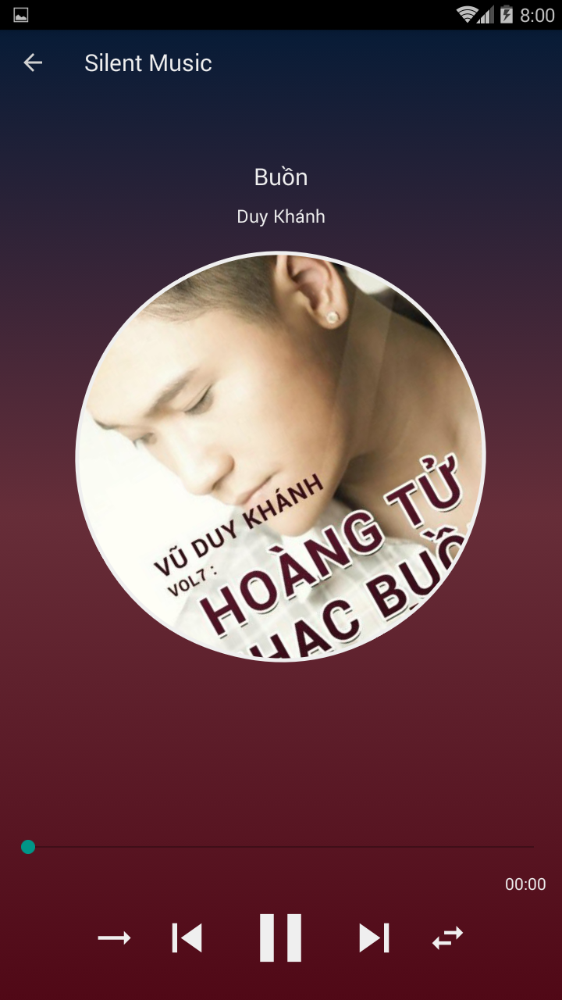

# Silent Music
Streaming music player for android (at least 4.4 version)

## Build status

## Screenshots

**Built with**
- [Android Studio 3.3.1](https://developer.android.com/studio/)

## Features
- [x] list .mp3 and .wav files in device
- [x] get songs from my web
- [x] play music
- [x] search song by name or artists
- [ ] search in playlist
- [ ] sort songs by name, album, artist,...

### Bugs

## Installation
- Clone this project
- Open Android Studio and then let it does everything
- Open PhpMyadmin, import database file in /silent_music

## API Reference
See in app/build.gradle

## Others
For more detail, see in [/silent_music/intross.docx](./silent_music/intross.docx)

## License
MIT © [Phạm Trung Kiên]()